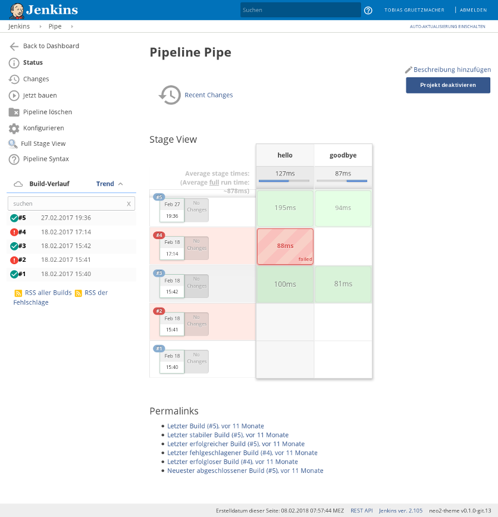

# Jenkins Neo2 Theme


[](https://travis-ci.com/TobiX/jenkins-neo2-theme)

Beautify your Jenkins with the a modern flat theme!

Website: https://tobix.github.io/jenkins-neo2-theme

This started as a fork to **jenkins-neo-theme**, which itself started as a fork
to the **jenkins-material-theme**, but was developed further to work correctly
with modern versions of Jenkins.


## Features

* Just one css file
* Embed minified SVG images
* Multiple ways to install

## Screenshots





## Installation

If you want to keep using an older release, replace `/dist/` in all URLs with
an older version, for example `/v0.2.0/`.

### Using this GitHub page

1. Install [Jenkins Simple Theme Plugin][simple]

2. Click `Manage Jenkins`

3. Click `Configure System` and scroll down to `Theme`

4. Specify the URL for `https://tobix.github.io/jenkins-neo2-theme/dist/neo-light.css`.

5. Click `Save`


### Using your Jenkins Hosting

1. Copy the file
   `https://tobix.github.io/jenkins-neo2-theme/dist/neo-light.css` to the
   directory `userContent` in your `JENKINS_HOME`

2. Follow the steps of the previous method and use `/userContent/neo-light.css`
   as the URL.


## Development

CSS file are minified and compressed with Grunt. If you have Node & yarn
installed, you can build everything with:

```
yarn test
```

This will generate the following file:

- dist/neo-light.css

## Compatibility

- Current Simple Theme plugin
- Current Jenkins LTS (older versions might still work, but compatibility isn't
  guaranteed)
- Firefox
- Chrome
- Microsoft IE11 and Edge (IE & Edge support isn't tested regularly)

If you are experiencing issues please let me know! Also, feel free to contribute!

## License

MIT License

## Thanks to

- [Jenkins neo theme][neo] for the inspiration and original work
- [Jenkins material theme][material] for the inspiration and original work
- [Simple Theme Plugin][simple] for the Simple Theme plugin
- [Google][google] for the the material design inspiration and the icons
- [Material Design Icons][material-design-icons] for some extra icons
- [canon-jenkins][canon-jenkins] for the base theme
- [@Heldroe][heldroe] for Firefox and Microsoft support

[neo]: https://github.com/jenkins-contrib-themes/jenkins-neo-theme
[material]: https://github.com/afonsof/jenkins-material-theme
[simple]: https://plugins.jenkins.io/simple-theme-plugin
[google]: https://www.google.com/design/spec/material-design/introduction.html
[material-design-icons]: https://materialdesignicons.com/
[canon-jenkins]: https://github.com/rackerlabs/canon-jenkins
[heldroe]: https://github.com/Heldroe
